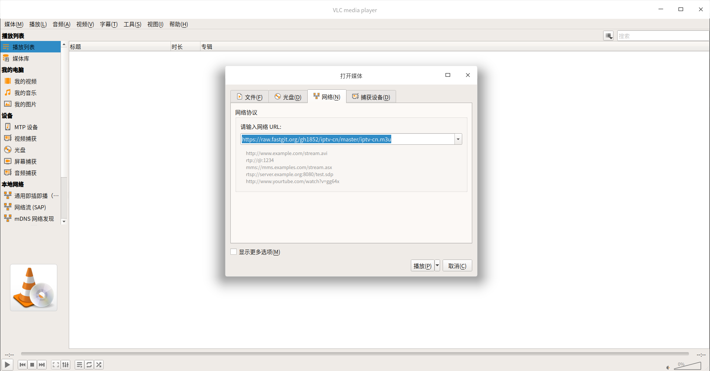

# iptv-cn
自用国内直播频道（定期更新～）

# 使用方式

打开支持m3u格式软件输入网络URL`https://raw.fastgit.org/gh1852/iptv-cn/master/iptv-cn.m3u`

# [支持m3u格式软件参考awesome-iptv](https://github.com/iptv-org/awesome-iptv#apps)

#### Web

- [Jackal](http://jackal.surge.sh) - Watch live tv from your browser with the help of Next application.
- [IPTV Player](https://iptv.maheshwarravuri.com) - Open-soure Flutter app that allows you to watch publicly accessible streams from within your browser.
- [WhatsUp TV](https://whatsuptv.app/) - Player for IPTV (.m3u) playlists.
- [IPTV-Streaming](http://iptv-streaming.tk) - IPTV live streaming.
- [IPTV Stream](http://yielding-meeting.surge.sh) - Watch IPTV online.
- [TVPeer](http://tvpeer.github.io/) - Watch Peer to Peer (P2P) IPTV online from your browser.
- [World TV Mobile](https://worldtvmobile.com/) - Search for the channel you prefer to tune in and stream in one click.
- [IPTVnator](https://iptvnator.vercel.app/) - Open-source and cross-platform IPTV player application with multiple features, such as support of m3u and m3u8 playlists, favorites, TV archive/catchup and more.

#### Windows

- [VLC for Windows](https://www.videolan.org/vlc/download-windows.html) - Free and open-source portable cross-platform media player.
- [Kodi](https://kodi.tv/) - Free cross-platform media player with library support.
  - [IPTV Simple PVR](https://kodi.tv/addon/pvr-client/pvr-iptv-simple-client) - IPTV Live TV and Radio PVR client addon for Kodi.
- [MPC-HC](https://github.com/clsid2/mpc-hc) - Free and open-source video and audio player for Windows.
- [PotPlayer](https://potplayer.daum.net/) - Free media player for Windows.
- [IPTVnator](https://github.com/4gray/iptvnator) - Free cross-platform IPTV streaming application with multiple features such as favorites, EPG, TV archive etc.
- [WhatsUp TV](https://www.microsoft.com/ru-ru/p/whatsup-tv/9pggvdsbtfvs?activetab=pivot:overviewtab) - Player for IPTV (.m3u) playlists.
- [termv](https://github.com/Roshan-R/termv) - A terminal IPTV player written in bash.

#### macOS

- [VLC for Mac OS X](https://www.videolan.org/vlc/download-macosx.html) - Free and open-source portable cross-platform media player.
- [IINA](https://iina.io/) - Modern media player for macOS.
- [Elmedia Video Player](https://apps.apple.com/us/app/elmedia-video-player/id1044549675) - Free media player for Mac OS.
- [Kodi](https://kodi.tv/) - Free cross-platform media player with library support.
  - [IPTV Simple PVR](https://kodi.tv/addon/pvr-client/pvr-iptv-simple-client) - IPTV Live TV and Radio PVR client addon for Kodi.
- [IPTVnator](https://github.com/4gray/iptvnator) - Free cross-platform IPTV streaming application with multiple features such as favorites, EPG, TV archive etc.
- [termv](https://github.com/Roshan-R/termv) - A terminal IPTV player written in bash.

#### Linux

- [VLC for Linux](https://www.videolan.org/vlc/#download) - Free and open-source portable cross-platform media player.
- [Kodi](https://kodi.tv/) - Free cross-platform media player with library support.
  - [IPTV Simple PVR](https://kodi.tv/addon/pvr-client/pvr-iptv-simple-client) - IPTV Live TV and Radio PVR client addon for Kodi.
- [Hypnotix](https://github.com/linuxmint/hypnotix) - A Free IPTV streaming application with support for live TV, movies and series.
- [IPTVnator](https://github.com/4gray/iptvnator) - Free cross-platform IPTV streaming application with multiple features such as favorites, EPG, TV archive etc.
- [FreetuxTV](https://github.com/freetuxtv/freetuxtv) - Internet television and radio player.
- [Astroncia IPTV](https://gitlab.com/astroncia/iptv) - IPTV player with EPG support.
- [termv](https://github.com/Roshan-R/termv) - A terminal IPTV player written in bash.

#### iOS

- [GSE SMART IPTV](https://apps.apple.com/us/app/gse-smart-iptv/id1028734023) - Complete user defined Advanced IPTV solutions for live and non-live TV/stream.
- [Movie Stream: Watch Smart IPTV](https://apps.apple.com/us/app/movie-stream-ip-tv-films/id1450912244) - Chromecast-enabled app which lets you stream your favourites videos from your mobile device to your TV.
- [Flex IPTV](https://apps.apple.com/ae/app/flex-iptv/id1182930255) - Allows you to view live and non-live TV/stream technology-based IPTV.
- [nPlayer](https://apps.apple.com/us/app/nplayer/id1116905928) - Media player with support DTS (DTS HD), DTS Headphone:X, Dolby (AC3, E-AC3).
- [FastoTV Lite](https://apps.apple.com/us/app/fastotvlite/id1496936356) - Open source ad-free IPTV client, with support for live media, VOD, favorites list and EPG.
- [WhatsUp TV](https://apps.apple.com/us/app/whatsup-tv/id1476950273) - Player for IPTV (.m3u) playlists.

#### Android

- [NET IP TV](https://play.google.com/store/apps/details?id=com.dnamedya.netiptv) - IPTV player for Android platform.
- [Kodi](https://play.google.com/store/apps/details?id=org.xbmc.kodi) - Free cross-platform media player with library support.
  - [IPTV Simple PVR](https://kodi.tv/addon/pvr-client/pvr-iptv-simple-client) - IPTV Live TV and Radio PVR client addon for Kodi.
- [KgTv Player](https://play.google.com/store/apps/details?id=tk.kgtv) - IPTV player with support quality change, search, export and modification of channels.
- [Perfect Player IPTV](https://play.google.com/store/apps/details?id=com.niklabs.pp&hl=en) - Set-top box style IPTV/Media player for watching videos on TVs, tablets and smartphones.
- [VLC for Android](https://play.google.com/store/apps/details?id=org.videolan.vlc) - Free and open-source portable cross-platform media player.
- [MX Player](https://play.google.com/store/apps/details?id=com.mxtech.videoplayer.ad) - Powerful video player with advanced hardware acceleration and subtitle support.
- [FastoTV Lite](https://play.google.com/store/apps/details?id=com.fastotv.lite) - Open source ad-free IPTV client, with support for live media, VOD, favorites list and EPG.
- [TiviMate IPTV Player](https://play.google.com/store/apps/details?id=ar.tvplayer.tv) - IPTV player for Android platform.
- [TVirl](https://play.google.com/store/apps/details?id=by.stari4ek.tvirl) - Special Android TV Input Service to integrate IPTV channels to pre-installed system TV App like [Live Channels](https://play.google.com/store/apps/details?id=com.google.android.tv).
- [IPTV](https://play.google.com/store/apps/details?id=ru.iptvremote.android.iptv) - The player allows you to watch IPTV from your Internet service provider or free live TV channels from any other source in the web.
- [CosmiTV Player](https://play.google.com/store/apps/details?id=com.cosmiquest.tv) - IPTV Player and DVR for Android that resembles the cable tv box.
- [SS IPTV](https://play.google.com/store/apps/details?id=com.ssiptv.tvapp) - Free multi-purpose player for playing video in local network or through internet.
- [Free WhatsUp TV](https://play.google.com/store/apps/details?id=au.com.deltaits.freewhatsuptv) - Player for IPTV (.m3u) playlists.
- [TV Player by TechArt](https://play.google.com/store/apps/details?id=com.cy8018.tvplayer) - Open source ad-free IPTV client with language, country and category filtering and a quick list of favorite channels.
- [kantv](https://github.com/zhouwg/kantv) - Open source player for Android.
- [TV.io Home Streaming](https://play.google.com/store/apps/details?id=com.player.online.tv&gl=GB) - IPTV streaming with Chromcast support and groups chat.
- [Insta IPTV](https://play.google.com/store/apps/details?id=com.iptv.insta_iptv) - Watch Live TV on your phone.

> m3u内容来源于开源项目[iptv-org/iptv](https://github.com/iptv-org/iptv)
